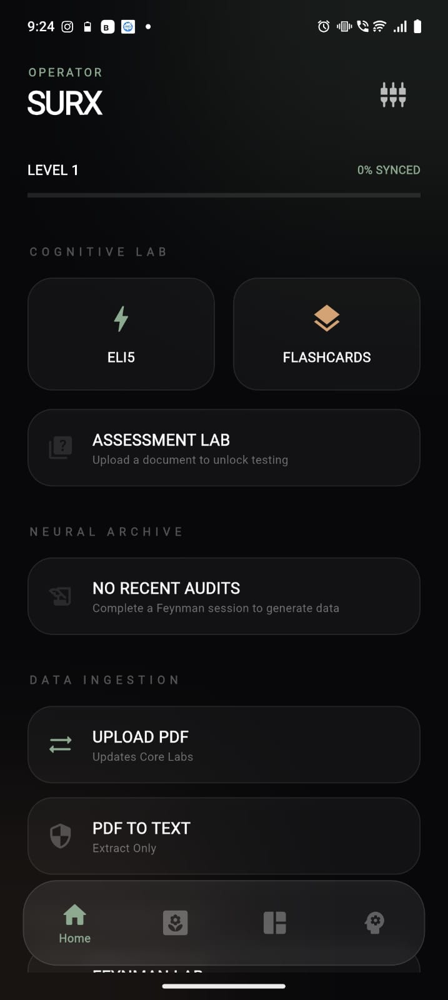
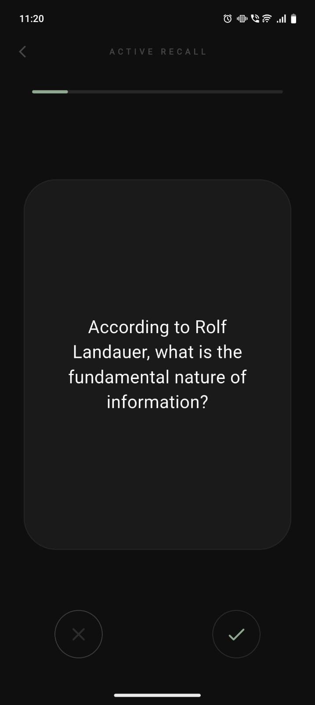
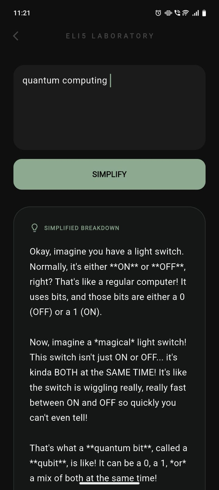
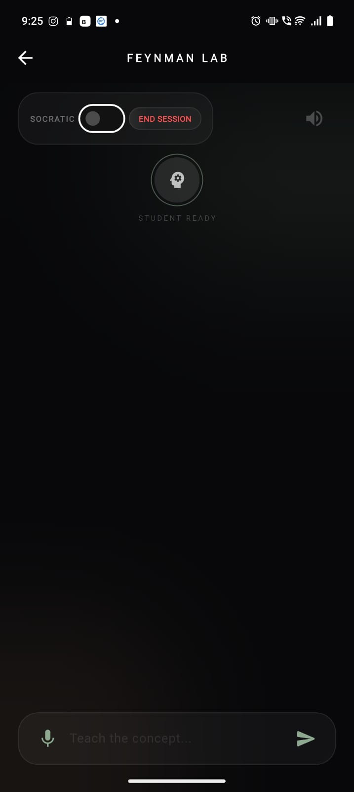
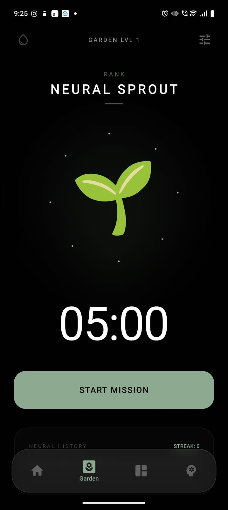
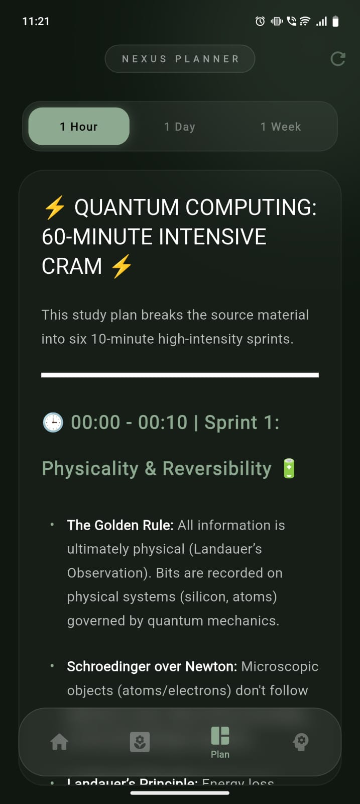

# 🧬 Synapse: Your Neural Garden (v0.4)

Forget cold, mechanical timers. **Synapse** is a living workspace designed to help you breathe, focus, and grow. It turns the friction of deep work into a biological ritual—where every minute of focus nourishes a digital ecosystem that evolves alongside your own mind.

---

## 🪴 What’s New in the Garden?

v0.4 is the **Atmospheric Update**, designed to pull you out of a busy room and into a calm, private sanctuary.

### 🌧️ The Rain Sanctuary
The centerpiece of this update. We didn't just add "noise"—we built a storm. 
- **Organic Downpour:** A 3D-layered rain system that actually has depth. Some drops fall fast and close, others are distant and misty, creating a "window" effect on your screen.
- **Audio Immersion:** A lush, looping rain soundscape (`rain.mp3`) that drowns out the world. It’s smart, too—the rain clears the moment your session ends, signaling a mental "reset."

### 🎖️ The Path of Evolution (New Ranks)
Your focus now has a visual legacy. We’ve introduced a hierarchy that rewards your consistency:
- **Rank Tiers:** Start as a humble **Neural Sprout** and work your way toward the legendary **Eternal Oak**.
- **Living Colors:** Watch the UI shift from a soft **Garden Green** to a deep **Neural Purple**, and eventually a prestigious **Eternal Gold** as you hit higher levels.

---

## ✨ Why it Feels Different

### 🌬️ A Breathing Ecosystem
The garden doesn't just sit there; it breathes. The **Aura** behind your plant pulses with a steady, calming rhythm, encouraging you to match your own breathing to the timer. Tiny **Pollen Orbitals** drift around the core like fireflies, giving the app a kinetic, "alive" energy.

### 🥀 Real Stakes (The Wither Mechanic)
Focus is a commitment. If you abandon a mission halfway through, your garden will **Wither**. It’s a gentle, visual reminder that your consistency matters. But don't worry—a new session always brings the green back.

### 📊 Your Neural Story
Check your **Neural History** to see a 14-day map of your progress. It’s a minimalist dot-matrix that visualizes your "Wins" and "Losses," making it easy to see your focus streaks at a glance.

### App Screenshots

  
  
  
  
  
  

---

## 🎮 Getting Started

Since you've got the **APK**, you’re nearly there. Just a couple of things to know:

1. **Dial it In:** Use the `Tune` icon to set your focus and break windows.
2. **Find Your Vibe:** Toggle the `Umbrella` icon. Whether you're in a loud cafe or a quiet office, the rain will create your "Neural Sanctuary."
3. **Interact:** Tap the plant! It responds to your touch with a haptic pulse—think of it as a digital pet for your productivity.
4. **Grow:** Keep the streak alive to see your Rank color change.

---

> *Your focus is the most valuable thing you own. Plant it wisely.*

