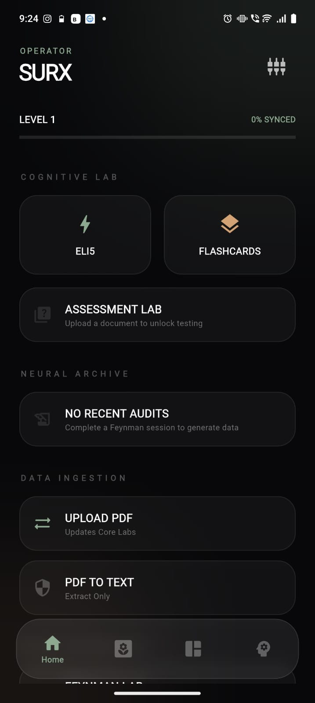
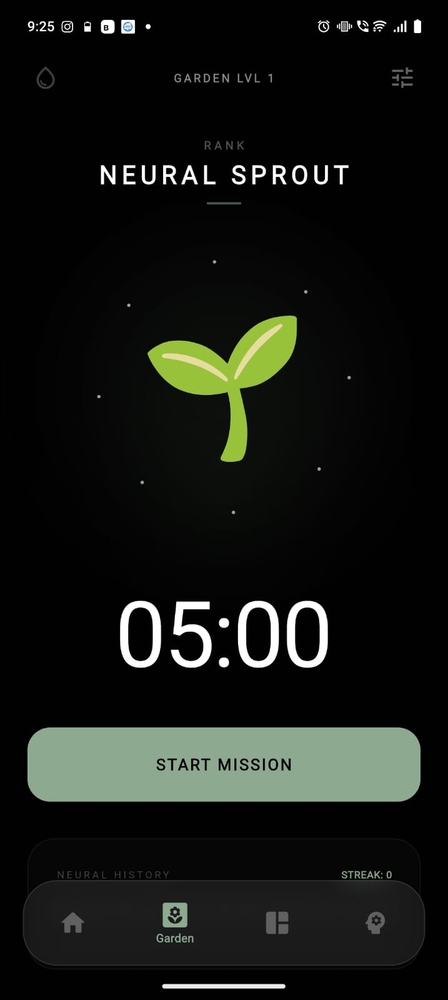
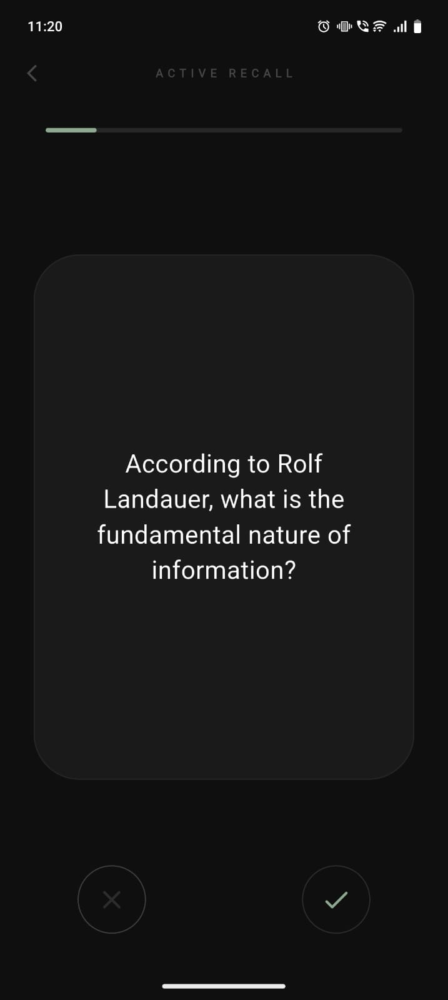
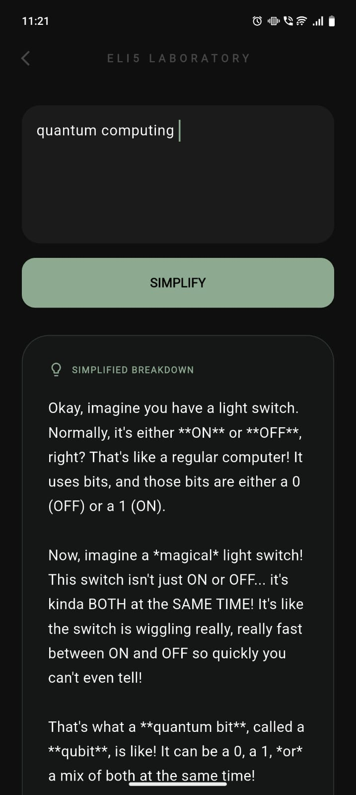
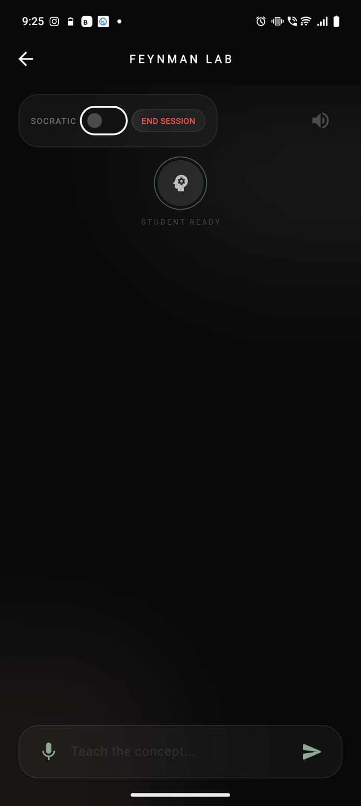
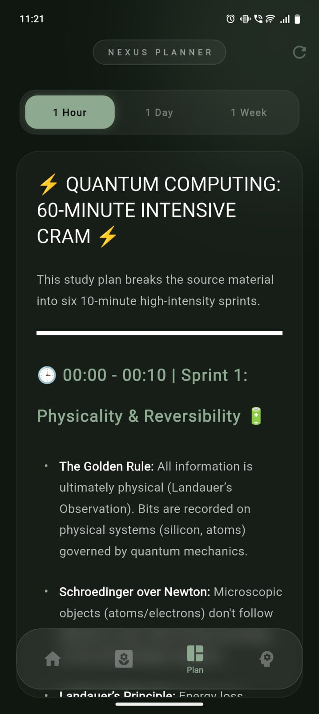

# 🧬 Synapse
### Your Neural Garden

*A living workspace that turns deep work into a biological ritual.*

**v0.4 — The Atmospheric Update**

---

Forget cold, mechanical timers. Synapse is a private sanctuary where every minute of focus nourishes a digital ecosystem that evolves alongside your own mind. No streak counters staring you down — just a garden that grows when you do, and wilts when you don't.

  
  
  

---

## Table of Contents

- [What's New in v0.4](#-whats-new-in-v04)
- [The Rank Hierarchy](#-the-rank-hierarchy)
- [The Cognitive Toolkit](#-the-cognitive-toolkit)
- [Why It Feels Different](#-why-it-feels-different)
- [Getting Started](#-getting-started)
- [Screenshots](#-screenshots)

---

## 🌧️ What's New in v0.4

v0.4 is the **Atmospheric Update** — designed to pull you out of a busy room and into a calm, private sanctuary.

### The Rain Sanctuary

The centerpiece of this release is a fully immersive weather engine. We didn't just add "noise" — we built a sensory storm designed to induce a flow state.

| Feature | What it does |
| :--- | :--- |
| **Organic Downpour** | A 3D-layered rain system with real depth — fast, close drops and distant, misty ones, like looking through a window into a forest. |
| **Natural Physics** | A subtle wind-slant and randomized timing keep the rain from ever feeling repetitive or robotic. |
| **Audio Immersion** | A lush, high-fidelity looping rain soundscape that drowns out environmental distractions. |
| **Smart Weather** | The rain is tied to your biology — it clears the moment your session ends, signaling a mental reset and bringing the sunlight back for your break. |

---

## 🎖️ The Rank Hierarchy

Progression in Synapse is visual and prestigious. As you complete missions, your rank title and the primary UI accent shift to reflect your dedication.

| Level | Rank Title | UI Theme | Aesthetic |
| :---: | :--- | :--- | :--- |
| 1–4 | **NEURAL SPROUT** | 🌱 Sprout Green | The beginning of growth — a faint, soft glow. |
| 5–9 | **SYNERGIC STEM** | 🧊 Focus Blue | Strengthening connections — a clearer, sharper aura. |
| 10–19 | **COGNITIVE CANOPY** | 🟣 Neural Purple | Deep mastery — intense, vibrant energy. |
| 20+ | **THE ETERNAL OAK** | 👑 Eternal Gold | Peak performance — a legendary golden shimmer. |

### Compete With Friends

Synapse is a private sanctuary — but growth makes for good competition.

- **Screenshot Battles** — Share your Neural History grid. A sea of green dots is the ultimate proof of discipline.
- **Level Racing** — Compare Garden Levels in the header. Higher level, more hours of deep work clocked.
- **The Wilt Challenge** — See who can go longest without hitting the Withered (🥀) state — and who reaches The Eternal Oak first.

---

## 🧠 The Cognitive Toolkit

Synapse isn't just a timer — it's a laboratory for your mind. Five specialized modules turn "studying" into "mastering."

- **Feynman Tab** — Inspired by Richard Feynman's principle that *if you can't explain it simply, you don't understand it.* Write out concepts as if teaching them, and find the gaps in your own knowledge.
- **ELI5 Tab** *(Explain Like I'm Five)* — The ultimate test of clarity. Strip the jargon and boil ideas down to their most basic, undeniable truths.
- **Flashcard Tab** — Combat the Forgetting Curve with active recall, the most scientifically proven way to move information into long-term memory.
- **Chat Tab** — Your neural co-pilot. Brainstorm a project, query a difficult fact, or reflect on what you've learned today.
- **Planner Tab** — Intention is the seed of focus. Map your day, set your objectives, and decide exactly what you're nourishing in your garden today.

---

## ✨ Why It Feels Different

**A Breathing Ecosystem**
The garden doesn't just sit there — it breathes. The Aura behind your plant pulses with a steady, calming rhythm, inviting you to match your own breathing to the timer, while Pollen Orbitals drift around the core like fireflies.

**Real Stakes — The Wither Mechanic**
Focus is a commitment. Abandon a mission halfway through, and your garden Wilts — a gentle, visual reminder that consistency matters. A new session always brings the green back.

**Your Neural Story**
Your Neural History maps 14 days of progress in a minimalist dot-matrix, making your focus streaks — and slumps — easy to see at a glance.

---

## 🎮 Getting Started

You've got the APK — you're nearly there.

1. **Dial it in** — Use the `Tune` icon to set your focus and break windows.
2. **Find your vibe** — Toggle the `Umbrella` icon. Whether you're in a loud cafe or a quiet office, the rain builds your Neural Sanctuary.
3. **Interact** — Tap the plant. It responds with a haptic pulse — a digital pet for your productivity.
4. **Grow** — Keep the streak alive and watch your rank color evolve.

---

## 📸 Screenshots

  
  
  
  
  
  

---

*Your focus is the most valuable thing you own. Plant it wisely.*

